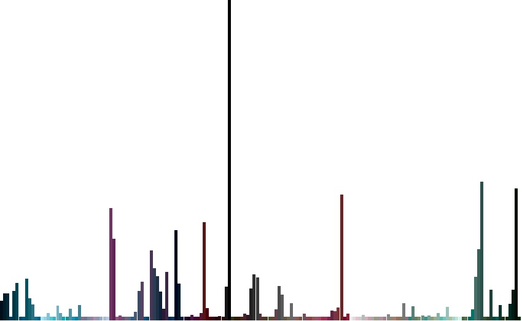
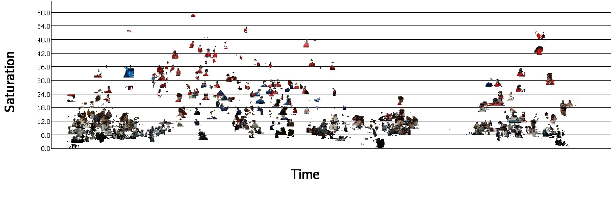

# README

This folder contains example exports from VIAN

### Direct Annotations
VIAN knows three types of direct annotations, which are always grouped in a Collection: 

| Annotation | Collection | Selector  |
| ------------- |:-------------| -----: |
| Temporal Segment | Segmentation | Temporal Range |
| SVG Annotation | AnnotationLayer | Temporal Range and Spatial |
| Screenshot | Screenshot Group | Single Frame |


### Tagging the Annotations
VIAN allows the user to tag their annotations with additional words from
controlled vocabularies. These have the purpose of classification: 

They also reference a web resource to the description of the word if existing.
```
{
    "context": "http://www.w3.org/ns/anno.jsonld",
    "id": "Keyword/1/2",
    "motivation": "classification",
    "creator": {
      "type": "Person",
      "name": "Gaudenz Halter",
      "email_sha1": "77f542b4bd4a5d8e1fb0a8da54b3793e5b6f1b2e"
    },
    "type": "Annotation",
    "body": {
      "type": "TextualBody",
      "value": "Global:Depth of Field:optical_diffusion",
      "format": "text/plain",
      "language": "en",
      "purpose": "classification",
      "url": "http://ercwebapp.westeurope.cloudapp.azure.com/api/vocabularies/get_concept/303"
    },
    "generator": {
      "id": "VIAN",
      "type": "Software",
      "name": "VIAN_0.7.7",
      "homepage": "https://github.com/ghalter/VIAN/"
    },
    "target": {
      "id": "trailer.mp4",
      "type": "Video",
      "selector": {
        "type": "FragmentSelector",
        "conformsTo": "http://www.w3.org/TR/media-frags/",
        "value": "trailer.mp4#t=13.6,38.5"
      }
    }
  }
```

### Numeric Analyses
Additionally, VIAN allows to compute numeric feature vectors for the selectors of 
the above created annotations. These are called **Analyses**. 

####Color Histogram
**Array:**
```
{
    "shape": (1,16,16,16), 
    "values": (Bins-L, Bins-A, Bins-B)
}

```




####Color Palette
A color palettes is a merge tree.

**Array:**
```
{
    "shape": (1,1024,6), 
    "values": (Merge-Depth, B,G,R, Size, Depth)
}

```


####Average Color
**Array:**
```
{
    "shape": (1,7), 
    "values": (B,G,R,L,A,B,S)
}

```


#### HDF5 File
Since JSON is not a suitable 
format for large numeric feature vectors, these analyses are stored in a seperate HDF5 file 
which is referenced in the export into VAINT. Such HDF5 Files are structured in datasets. 
Each dataset is a continuous array of feature vectors. VIAN exports these by referencing the 
dataset name and the array index of the corresponding feature vector. 

```
{
    "context": "http://www.w3.org/ns/anno.jsonld",
    "id": "Gaudenz_Halter:1_1_1_NetflixTrailer_1900_VHS/Analysis/1/1",
    "motivation": "describing",
    "creator": {
      "type": "Person",
      "name": "Gaudenz Halter",
      "email_sha1": "77f542b4bd4a5d8e1fb0a8da54b3793e5b6f1b2e"
    },
    "type": "Annotation",
    "body": {
      "type": "VIANAnalysis",
      "value": {
        "hdf5_dataset": "ColorHistograms",
        "hdf5_index": 37
      },
      "format": "hdf5",
      "language": "en",
      "purpose": "describing"
    },
    "generator": {
      "id": "VIAN",
      "type": "Software",
      "name": "VIAN_0.7.7",
      "homepage": "https://github.com/ghalter/VIAN/"
    },
    "target": {
      "id": "trailer.mp4",
      "type": "Video",
      "selector": {
        "type": "FragmentSelector",
        "conformsTo": "http://www.w3.org/TR/media-frags/",
        "value": "trailer.mp4#t=4.72,4.72"
      }
    }
  }
```